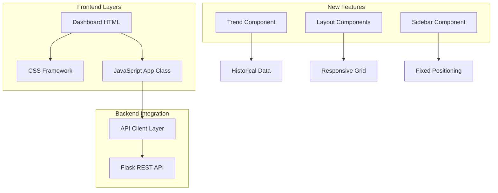
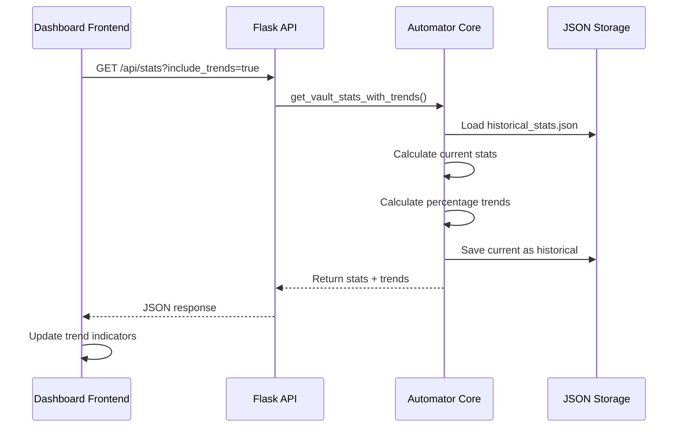
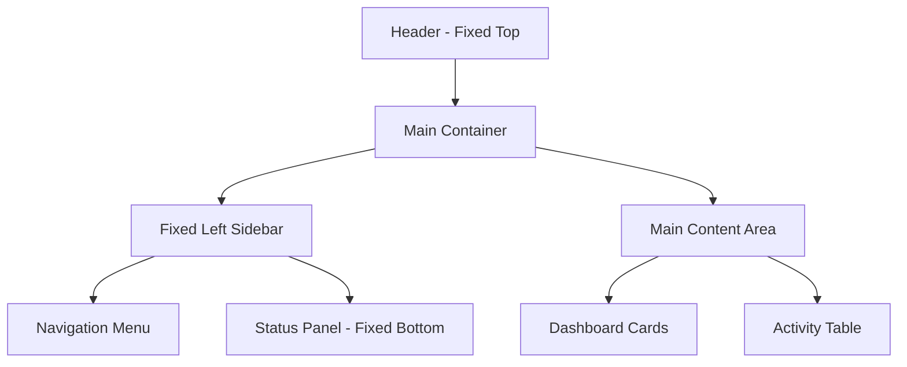
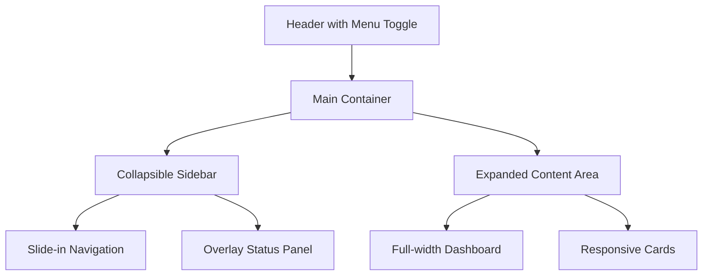
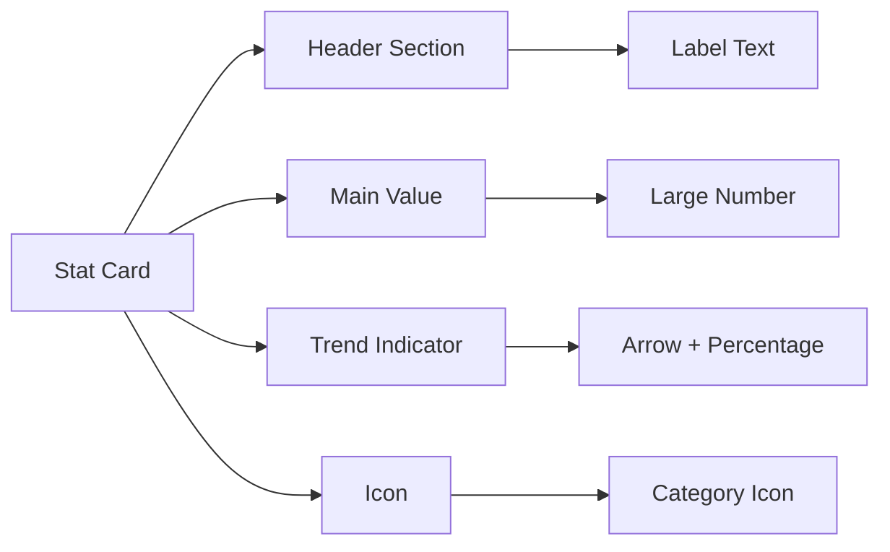

# Dashboard UI/UX Improvements Design

## Overview

This design document outlines comprehensive improvements to the Obsidian Tag Automator dashboard, focusing on three main areas:

1. **Trend Statistics Implementation** - Replace "No data" placeholders with meaningful percentage-based trend indicators
2. **Dashboard Layout Optimization** - Fix sidebar scrolling and create multiple layout alternatives
3. **UI/UX Enhancements** - Improve visual hierarchy, responsiveness, and user experience

## Technology Stack

### Frontend Technologies
- **HTML5**: Modern semantic markup
- **Tailwind CSS**: Utility-first CSS framework via CDN
- **Vanilla JavaScript**: ES6+ class-based architecture
- **Font Awesome**: Icon library for consistent iconography
- **Inter Font**: Typography for professional appearance

### Backend Technologies
- **Flask**: Web framework serving REST API
- **Python 3.8+**: Core business logic
- **JSON**: Data persistence for historical statistics

## Architecture

### Frontend Architecture


### Data Flow for Trend Feature


## Dashboard Layout Improvements

### Problem Analysis
- **Scrolling Sidebar**: Current sidebar scrolls with page content instead of being fixed
- **Layout Inconsistency**: Sidebar positioning affects user navigation experience
- **Responsive Issues**: Layout breaks on smaller screens

### Layout Solution Options

#### Option 1: Fixed Sidebar Layout


**Characteristics:**
- Fixed sidebar that doesn't scroll
- Status panel fixed at bottom of sidebar
- Main content scrolls independently
- Clean separation of navigation and content

#### Option 2: Collapsible Sidebar Layout


**Characteristics:**
- Mobile-first collapsible sidebar
- Hamburger menu for small screens
- Overlay sidebar on mobile
- Maximum content area utilization

### Recommended Layout: Fixed Sidebar (Option 1)

#### Implementation Details
```css
.dashboard-layout {
  display: grid;
  grid-template-columns: 280px 1fr;
  grid-template-rows: auto 1fr;
  height: 100vh;
  overflow: hidden;
}

.sidebar {
  position: fixed;
  left: 0;
  top: 0;
  height: 100vh;
  width: 280px;
  overflow-y: auto;
  z-index: 10;
}

.main-content {
  margin-left: 280px;
  overflow-y: auto;
  height: 100vh;
}

@media (max-width: 1024px) {
  .dashboard-layout {
    grid-template-columns: 1fr;
  }
  
  .sidebar {
    transform: translateX(-100%);
    transition: transform 0.3s ease;
  }
  
  .sidebar.open {
    transform: translateX(0);
  }
  
  .main-content {
    margin-left: 0;
  }
}
```

## Trend Statistics Feature

### Current Issue
Dashboard cards show "No data" instead of meaningful trend information that should display percentage changes like "↑ 12% from last week".

### Data Model for Trends

#### Historical Statistics Storage
```json
{
  "timestamp": "2024-01-15T10:30:00Z",
  "total_files": 1247,
  "tagged_files": 892,
  "total_tags": 346,
  "ai_processed_files": 543,
  "last_updated": "2024-01-15T10:30:00Z"
}
```

#### Trend Calculation Logic
```python
def calculate_trends(current_stats, historical_stats):
    """Calculate percentage trends for dashboard metrics."""
    trends = {}
    
    for metric in ['total_files', 'tagged_files', 'total_tags']:
        current_value = current_stats.get(metric, 0)
        historical_value = historical_stats.get(metric, 0)
        
        if historical_value > 0:
            percentage_change = ((current_value - historical_value) / historical_value) * 100
            trends[metric] = {
                'value': round(percentage_change, 1),
                'direction': 'up' if percentage_change > 0 else 'down' if percentage_change < 0 else 'same',
                'previous_value': historical_value,
                'current_value': current_value
            }
        else:
            trends[metric] = {
                'value': 0,
                'direction': 'same',
                'previous_value': 0,
                'current_value': current_value
            }
    
    return trends
```

### Backend Implementation

#### Enhanced API Endpoint
```python
@app.route('/api/stats')
def get_vault_stats_with_trends():
    """Get vault statistics with trend calculations."""
    try:
        include_trends = request.args.get('include_trends', 'false').lower() == 'true'
        
        # Get current stats
        current_stats = self.automator.get_vault_stats()
        
        response = {
            'success': True,
            'stats': current_stats['stats'],
            'trends': {}
        }
        
        if include_trends:
            # Load historical data
            historical_stats = self.automator.load_historical_stats()
            
            # Calculate trends
            trends = self.automator.calculate_trends(
                current_stats['stats'], 
                historical_stats
            )
            response['trends'] = trends
            
            # Save current stats as historical for next time
            self.automator.save_historical_stats(current_stats['stats'])
        
        return jsonify(response)
    except Exception as e:
        return jsonify({'success': False, 'error': str(e)}), 500
```

#### Core Automator Methods
```python
class ObsidianTagAutomatorCore:
    def get_historical_stats_path(self):
        """Get path to historical statistics file."""
        return self.vault_path / '.obsidian' / 'automator_stats.json'
    
    def load_historical_stats(self):
        """Load historical statistics from storage."""
        stats_path = self.get_historical_stats_path()
        if stats_path.exists():
            try:
                with open(stats_path, 'r', encoding='utf-8') as f:
                    data = json.load(f)
                    return data.get('stats', {})
            except (json.JSONDecodeError, IOError):
                return {}
        return {}
    
    def save_historical_stats(self, current_stats):
        """Save current statistics as historical data."""
        stats_path = self.get_historical_stats_path()
        stats_path.parent.mkdir(exist_ok=True)
        
        historical_data = {
            'timestamp': datetime.now().isoformat(),
            'stats': current_stats
        }
        
        try:
            with open(stats_path, 'w', encoding='utf-8') as f:
                json.dump(historical_data, f, indent=2)
        except IOError as e:
            print(f"Warning: Could not save historical stats: {e}")
```

### Frontend Implementation

#### Trend Display Component
```javascript
class TrendIndicator {
    static update(elementId, trend) {
        const element = document.getElementById(elementId);
        if (!element || !trend) {
            element.innerHTML = '<i class="fas fa-minus mr-1"></i> No data';
            return;
        }

        const { direction, value } = trend;
        let icon, color, text;
        
        switch(direction) {
            case 'up':
                icon = 'fas fa-arrow-up';
                color = 'text-green-400';
                text = `${value}% from last week`;
                break;
            case 'down':
                icon = 'fas fa-arrow-down';
                color = 'text-red-400';
                text = `${Math.abs(value)}% from last week`;
                break;
            default:
                icon = 'fas fa-minus';
                color = 'text-yellow-400';
                text = 'No change from last week';
        }
        
        element.innerHTML = `<i class="${icon} mr-1 ${color}"></i> ${text}`;
    }
}
```

#### Enhanced Dashboard Loading
```javascript
async loadDashboard() {
    try {
        this.showSkeletonLoaders();
        
        const [status, stats] = await Promise.all([
            this.apiGet('/status?stats=true'),
            this.apiGet('/stats?include_trends=true')
        ]);

        this.updateStatusPanel(status);
        this.updateDashboardStats(stats.stats, stats.trends);
        
    } catch (error) {
        console.error('Failed to load dashboard:', error);
        this.showStatsError(error.message);
    }
}

updateDashboardStats(stats, trends) {
    if (!stats) return;

    // Update main statistics
    document.getElementById('dashboard-total-files').textContent = stats.total_files || '-';
    document.getElementById('dashboard-tagged-files').textContent = stats.tagged_files || '-';
    document.getElementById('dashboard-unique-tags').textContent = stats.total_tags || '-';

    // Update trend indicators
    TrendIndicator.update('total-files-trend', trends?.total_files);
    TrendIndicator.update('tagged-files-trend', trends?.tagged_files);
    TrendIndicator.update('unique-tags-trend', trends?.total_tags);
}
```

## Component Specifications

### Dashboard Statistics Cards


#### Card Structure
```html
<div class="stat-card bg-gradient-to-br from-blue-900/50 to-blue-800/30 rounded-xl p-5 border border-blue-700/30 hover-lift">
    <div class="flex justify-between items-start">
        <div class="stat-content">
            <p class="stat-label text-gray-400 text-sm">Total Files</p>
            <p class="stat-value text-3xl font-bold mt-1" id="dashboard-total-files">1,247</p>
        </div>
        <div class="stat-icon bg-blue-500/20 p-3 rounded-lg">
            <i class="fas fa-file-alt text-blue-400 text-xl"></i>
        </div>
    </div>
    <div class="stat-trend mt-4 text-sm flex items-center" id="total-files-trend">
        <i class="fas fa-arrow-up mr-1 text-green-400"></i> 12% from last week
    </div>
</div>
```

### Sidebar Navigation Component
```html
<div class="sidebar glass-effect">
    <div class="sidebar-header p-6">
        <h2 class="text-xl font-semibold text-blue-300 flex items-center">
            <i class="fas fa-cogs mr-2"></i> Control Panel
        </h2>
    </div>
    
    <nav class="sidebar-nav px-4 space-y-2">
        <!-- Navigation items -->
    </nav>
    
    <div class="sidebar-footer p-4 mt-auto">
        <div class="status-panel glass-effect rounded-xl p-4">
            <!-- Status information -->
        </div>
    </div>
</div>
```

## UI/UX Enhancements

### Visual Hierarchy Improvements
1. **Typography Scale**: Consistent heading sizes and line heights
2. **Color Contrast**: Improved accessibility with proper contrast ratios
3. **Spacing System**: Consistent margin and padding using Tailwind's spacing scale
4. **Interactive States**: Clear hover, focus, and active states for all interactive elements

### Responsive Design Strategy
```css
/* Mobile First Approach */
.dashboard-container {
  padding: 1rem;
}

/* Tablet */
@media (min-width: 768px) {
  .dashboard-container {
    padding: 1.5rem;
  }
  
  .stats-grid {
    grid-template-columns: repeat(2, 1fr);
  }
}

/* Desktop */
@media (min-width: 1024px) {
  .dashboard-container {
    padding: 2rem;
  }
  
  .stats-grid {
    grid-template-columns: repeat(3, 1fr);
  }
  
  .sidebar {
    position: fixed;
  }
}
```

### Animation and Transitions
```css
.hover-lift {
  transition: transform 0.3s ease, box-shadow 0.3s ease;
}

.hover-lift:hover {
  transform: translateY(-5px);
  box-shadow: 0 10px 25px rgba(0, 0, 0, 0.3);
}

.slide-in {
  animation: slideIn 0.5s ease-out;
}

@keyframes slideIn {
  from { transform: translateX(100%); opacity: 0; }
  to { transform: translateX(0); opacity: 1; }
}
```

### Performance Optimizations
1. **Skeleton Loading**: Show loading states for better perceived performance
2. **Lazy Loading**: Load non-critical content after initial render
3. **API Caching**: Cache API responses to reduce server requests
4. **Image Optimization**: Use appropriate image formats and sizes

## Implementation Phases

### Phase 1: Layout Fixes (Week 1)
- Implement fixed sidebar layout
- Fix scrolling behavior
- Add responsive breakpoints
- Create mobile navigation

### Phase 2: Trend Feature (Week 1-2)
- Implement backend historical stats storage
- Add trend calculation logic
- Create frontend trend components
- Update API endpoints

### Phase 3: UI/UX Polish (Week 2)
- Implement animations and transitions
- Add skeleton loading states
- Improve accessibility
- Performance optimization

### Phase 4: Alternative Layouts (Week 2-3)
- Create collapsible sidebar option
- Implement layout switcher
- Add user preference storage
- Testing and refinement

## Testing Strategy

### Frontend Testing
```javascript
// Test trend calculation display
describe('TrendIndicator', () => {
  it('should display positive trend correctly', () => {
    const trend = { direction: 'up', value: 12.5 };
    TrendIndicator.update('test-element', trend);
    expect(element.innerHTML).toContain('fa-arrow-up');
    expect(element.innerHTML).toContain('12.5%');
  });
});
```

### Backend Testing
```python
def test_trend_calculation():
    """Test trend calculation logic."""
    current = {'total_files': 120, 'tagged_files': 80}
    historical = {'total_files': 100, 'tagged_files': 75}
    
    trends = calculate_trends(current, historical)
    
    assert trends['total_files']['value'] == 20.0
    assert trends['total_files']['direction'] == 'up'
```

### Integration Testing
- API endpoint responses
- Frontend-backend data flow
- Cross-browser compatibility
- Mobile responsiveness

## Accessibility Considerations

### WCAG 2.1 Compliance
- **Color Contrast**: Minimum 4.5:1 ratio for text
- **Keyboard Navigation**: Full keyboard accessibility
- **Screen Reader Support**: Proper ARIA labels and descriptions
- **Focus Management**: Clear focus indicators

### Implementation
```html
<div class="stat-card" role="article" aria-labelledby="total-files-label">
  <h3 id="total-files-label" class="sr-only">Total Files Statistics</h3>
  <p class="stat-label" aria-describedby="total-files-value">Total Files</p>
  <p id="total-files-value" class="stat-value">1,247</p>
  <div class="stat-trend" aria-live="polite">12% increase from last week</div>
</div>
```

## Error Handling and Fallbacks

### Progressive Enhancement
- Graceful degradation when JavaScript is disabled
- Fallback content for failed API calls
- Error boundary components for React-like error handling

### Error States
```javascript
showStatsError(error) {
  const errorContent = `
    <div class="error-state text-center py-8">
      <i class="fas fa-exclamation-triangle text-red-400 text-3xl mb-4"></i>
      <h3 class="text-lg font-semibold text-red-400 mb-2">Unable to Load Statistics</h3>
      <p class="text-gray-400 mb-4">${error}</p>
      <button onclick="app.retryLoadStats()" class="btn-primary">
        <i class="fas fa-redo mr-2"></i>Retry
      </button>
    </div>
  `;
  
  document.getElementById('stats-container').innerHTML = errorContent;
}
```
### Frontend Technologies
- **HTML5**: Modern semantic markup
- **Tailwind CSS**: Utility-first CSS framework via CDN
- **Vanilla JavaScript**: ES6+ class-based architecture
- **Font Awesome**: Icon library for consistent iconography
- **Inter Font**: Typography for professional appearance

### Backend Technologies
- **Flask**: Web framework serving REST API
- **Python 3.8+**: Core business logic
- **JSON**: Data persistence for historical statistics

## Architecture

### Frontend Architecture


### Data Flow for Trend Feature


## Dashboard Layout Improvements

### Problem Analysis
- **Scrolling Sidebar**: Current sidebar scrolls with page content instead of being fixed
- **Layout Inconsistency**: Sidebar positioning affects user navigation experience
- **Responsive Issues**: Layout breaks on smaller screens

### Layout Solution Options

#### Option 1: Fixed Sidebar Layout


**Characteristics:**
- Fixed sidebar that doesn't scroll
- Status panel fixed at bottom of sidebar
- Main content scrolls independently
- Clean separation of navigation and content

#### Option 2: Collapsible Sidebar Layout


**Characteristics:**
- Mobile-first collapsible sidebar
- Hamburger menu for small screens
- Overlay sidebar on mobile
- Maximum content area utilization

### Recommended Layout: Fixed Sidebar (Option 1)

#### Implementation Details
```css
.dashboard-layout {
  display: grid;
  grid-template-columns: 280px 1fr;
  grid-template-rows: auto 1fr;
  height: 100vh;
  overflow: hidden;
}

.sidebar {
  position: fixed;
  left: 0;
  top: 0;
  height: 100vh;
  width: 280px;
  overflow-y: auto;
  z-index: 10;
}

.main-content {
  margin-left: 280px;
  overflow-y: auto;
  height: 100vh;
}

@media (max-width: 1024px) {
  .dashboard-layout {
    grid-template-columns: 1fr;
  }
  
  .sidebar {
    transform: translateX(-100%);
    transition: transform 0.3s ease;
  }
  
  .sidebar.open {
    transform: translateX(0);
  }
  
  .main-content {
    margin-left: 0;
  }
}
```

## Trend Statistics Feature

### Current Issue
Dashboard cards show "No data" instead of meaningful trend information that should display percentage changes like "↑ 12% from last week".

### Data Model for Trends

#### Historical Statistics Storage
```json
{
  "timestamp": "2024-01-15T10:30:00Z",
  "total_files": 1247,
  "tagged_files": 892,
  "total_tags": 346,
  "ai_processed_files": 543,
  "last_updated": "2024-01-15T10:30:00Z"
}
```

#### Trend Calculation Logic
```python
def calculate_trends(current_stats, historical_stats):
    """Calculate percentage trends for dashboard metrics."""
    trends = {}
    
    for metric in ['total_files', 'tagged_files', 'total_tags']:
        current_value = current_stats.get(metric, 0)
        historical_value = historical_stats.get(metric, 0)
        
        if historical_value > 0:
            percentage_change = ((current_value - historical_value) / historical_value) * 100
            trends[metric] = {
                'value': round(percentage_change, 1),
                'direction': 'up' if percentage_change > 0 else 'down' if percentage_change < 0 else 'same',
                'previous_value': historical_value,
                'current_value': current_value
            }
        else:
            trends[metric] = {
                'value': 0,
                'direction': 'same',
                'previous_value': 0,
                'current_value': current_value
            }
    
    return trends
```

### Backend Implementation

#### Enhanced API Endpoint
```python
@app.route('/api/stats')
def get_vault_stats_with_trends():
    """Get vault statistics with trend calculations."""
    try:
        include_trends = request.args.get('include_trends', 'false').lower() == 'true'
        
        # Get current stats
        current_stats = self.automator.get_vault_stats()
        
        response = {
            'success': True,
            'stats': current_stats['stats'],
            'trends': {}
        }
        
        if include_trends:
            # Load historical data
            historical_stats = self.automator.load_historical_stats()
            
            # Calculate trends
            trends = self.automator.calculate_trends(
                current_stats['stats'], 
                historical_stats
            )
            response['trends'] = trends
            
            # Save current stats as historical for next time
            self.automator.save_historical_stats(current_stats['stats'])
        
        return jsonify(response)
    except Exception as e:
        return jsonify({'success': False, 'error': str(e)}), 500
```

#### Core Automator Methods
```python
class ObsidianTagAutomatorCore:
    def get_historical_stats_path(self):
        """Get path to historical statistics file."""
        return self.vault_path / '.obsidian' / 'automator_stats.json'
    
    def load_historical_stats(self):
        """Load historical statistics from storage."""
        stats_path = self.get_historical_stats_path()
        if stats_path.exists():
            try:
                with open(stats_path, 'r', encoding='utf-8') as f:
                    data = json.load(f)
                    return data.get('stats', {})
            except (json.JSONDecodeError, IOError):
                return {}
        return {}
    
    def save_historical_stats(self, current_stats):
        """Save current statistics as historical data."""
        stats_path = self.get_historical_stats_path()
        stats_path.parent.mkdir(exist_ok=True)
        
        historical_data = {
            'timestamp': datetime.now().isoformat(),
            'stats': current_stats
        }
        
        try:
            with open(stats_path, 'w', encoding='utf-8') as f:
                json.dump(historical_data, f, indent=2)
        except IOError as e:
            print(f"Warning: Could not save historical stats: {e}")
```

### Frontend Implementation

#### Trend Display Component
```javascript
class TrendIndicator {
    static update(elementId, trend) {
        const element = document.getElementById(elementId);
        if (!element || !trend) {
            element.innerHTML = '<i class="fas fa-minus mr-1"></i> No data';
            return;
        }

        const { direction, value } = trend;
        let icon, color, text;
        
        switch(direction) {
            case 'up':
                icon = 'fas fa-arrow-up';
                color = 'text-green-400';
                text = `${value}% from last week`;
                break;
            case 'down':
                icon = 'fas fa-arrow-down';
                color = 'text-red-400';
                text = `${Math.abs(value)}% from last week`;
                break;
            default:
                icon = 'fas fa-minus';
                color = 'text-yellow-400';
                text = 'No change from last week';
        }
        
        element.innerHTML = `<i class="${icon} mr-1 ${color}"></i> ${text}`;
    }
}
```

#### Enhanced Dashboard Loading
```javascript
async loadDashboard() {
    try {
        this.showSkeletonLoaders();
        
        const [status, stats] = await Promise.all([
            this.apiGet('/status?stats=true'),
            this.apiGet('/stats?include_trends=true')
        ]);

        this.updateStatusPanel(status);
        this.updateDashboardStats(stats.stats, stats.trends);
        
    } catch (error) {
        console.error('Failed to load dashboard:', error);
        this.showStatsError(error.message);
    }
}

updateDashboardStats(stats, trends) {
    if (!stats) return;

    // Update main statistics
    document.getElementById('dashboard-total-files').textContent = stats.total_files || '-';
    document.getElementById('dashboard-tagged-files').textContent = stats.tagged_files || '-';
    document.getElementById('dashboard-unique-tags').textContent = stats.total_tags || '-';

    // Update trend indicators
    TrendIndicator.update('total-files-trend', trends?.total_files);
    TrendIndicator.update('tagged-files-trend', trends?.tagged_files);
    TrendIndicator.update('unique-tags-trend', trends?.total_tags);
}
```

## Component Specifications

### Dashboard Statistics Cards


#### Card Structure
```html
<div class="stat-card bg-gradient-to-br from-blue-900/50 to-blue-800/30 rounded-xl p-5 border border-blue-700/30 hover-lift">
    <div class="flex justify-between items-start">
        <div class="stat-content">
            <p class="stat-label text-gray-400 text-sm">Total Files</p>
            <p class="stat-value text-3xl font-bold mt-1" id="dashboard-total-files">1,247</p>
        </div>
        <div class="stat-icon bg-blue-500/20 p-3 rounded-lg">
            <i class="fas fa-file-alt text-blue-400 text-xl"></i>
        </div>
    </div>
    <div class="stat-trend mt-4 text-sm flex items-center" id="total-files-trend">
        <i class="fas fa-arrow-up mr-1 text-green-400"></i> 12% from last week
    </div>
</div>
```

### Sidebar Navigation Component
```html
<div class="sidebar glass-effect">
    <div class="sidebar-header p-6">
        <h2 class="text-xl font-semibold text-blue-300 flex items-center">
            <i class="fas fa-cogs mr-2"></i> Control Panel
        </h2>
    </div>
    
    <nav class="sidebar-nav px-4 space-y-2">
        <!-- Navigation items -->
    </nav>
    
    <div class="sidebar-footer p-4 mt-auto">
        <div class="status-panel glass-effect rounded-xl p-4">
            <!-- Status information -->
        </div>
    </div>
</div>
```

## UI/UX Enhancements

### Visual Hierarchy Improvements
1. **Typography Scale**: Consistent heading sizes and line heights
2. **Color Contrast**: Improved accessibility with proper contrast ratios
3. **Spacing System**: Consistent margin and padding using Tailwind's spacing scale
4. **Interactive States**: Clear hover, focus, and active states for all interactive elements

### Responsive Design Strategy
```css
/* Mobile First Approach */
.dashboard-container {
  padding: 1rem;
}

/* Tablet */
@media (min-width: 768px) {
  .dashboard-container {
    padding: 1.5rem;
  }
  
  .stats-grid {
    grid-template-columns: repeat(2, 1fr);
  }
}

/* Desktop */
@media (min-width: 1024px) {
  .dashboard-container {
    padding: 2rem;
  }
  
  .stats-grid {
    grid-template-columns: repeat(3, 1fr);
  }
  
  .sidebar {
    position: fixed;
  }
}
```

### Animation and Transitions
```css
.hover-lift {
  transition: transform 0.3s ease, box-shadow 0.3s ease;
}

.hover-lift:hover {
  transform: translateY(-5px);
  box-shadow: 0 10px 25px rgba(0, 0, 0, 0.3);
}

.slide-in {
  animation: slideIn 0.5s ease-out;
}

@keyframes slideIn {
  from { transform: translateX(100%); opacity: 0; }
  to { transform: translateX(0); opacity: 1; }
}
```

### Performance Optimizations
1. **Skeleton Loading**: Show loading states for better perceived performance
2. **Lazy Loading**: Load non-critical content after initial render
3. **API Caching**: Cache API responses to reduce server requests
4. **Image Optimization**: Use appropriate image formats and sizes

## Implementation Phases

### Phase 1: Layout Fixes (Week 1)
- Implement fixed sidebar layout
- Fix scrolling behavior
- Add responsive breakpoints
- Create mobile navigation

### Phase 2: Trend Feature (Week 1-2)
- Implement backend historical stats storage
- Add trend calculation logic
- Create frontend trend components
- Update API endpoints

### Phase 3: UI/UX Polish (Week 2)
- Implement animations and transitions
- Add skeleton loading states
- Improve accessibility
- Performance optimization

### Phase 4: Alternative Layouts (Week 2-3)
- Create collapsible sidebar option
- Implement layout switcher
- Add user preference storage
- Testing and refinement

## Testing Strategy

### Frontend Testing
```javascript
// Test trend calculation display
describe('TrendIndicator', () => {
  it('should display positive trend correctly', () => {
    const trend = { direction: 'up', value: 12.5 };
    TrendIndicator.update('test-element', trend);
    expect(element.innerHTML).toContain('fa-arrow-up');
    expect(element.innerHTML).toContain('12.5%');
  });
});
```

### Backend Testing
```python
def test_trend_calculation():
    """Test trend calculation logic."""
    current = {'total_files': 120, 'tagged_files': 80}
    historical = {'total_files': 100, 'tagged_files': 75}
    
    trends = calculate_trends(current, historical)
    
    assert trends['total_files']['value'] == 20.0
    assert trends['total_files']['direction'] == 'up'
```

### Integration Testing
- API endpoint responses
- Frontend-backend data flow
- Cross-browser compatibility
- Mobile responsiveness

## Accessibility Considerations

### WCAG 2.1 Compliance
- **Color Contrast**: Minimum 4.5:1 ratio for text
- **Keyboard Navigation**: Full keyboard accessibility
- **Screen Reader Support**: Proper ARIA labels and descriptions
- **Focus Management**: Clear focus indicators

### Implementation
```html
<div class="stat-card" role="article" aria-labelledby="total-files-label">
  <h3 id="total-files-label" class="sr-only">Total Files Statistics</h3>
  <p class="stat-label" aria-describedby="total-files-value">Total Files</p>
  <p id="total-files-value" class="stat-value">1,247</p>
  <div class="stat-trend" aria-live="polite">12% increase from last week</div>
</div>
```

## Error Handling and Fallbacks

### Progressive Enhancement
- Graceful degradation when JavaScript is disabled
- Fallback content for failed API calls
- Error boundary components for React-like error handling

### Error States
```javascript
showStatsError(error) {
  const errorContent = `
    <div class="error-state text-center py-8">
      <i class="fas fa-exclamation-triangle text-red-400 text-3xl mb-4"></i>
      <h3 class="text-lg font-semibold text-red-400 mb-2">Unable to Load Statistics</h3>
      <p class="text-gray-400 mb-4">${error}</p>
      <button onclick="app.retryLoadStats()" class="btn-primary">
        <i class="fas fa-redo mr-2"></i>Retry
      </button>
    </div>
  `;
  
  document.getElementById('stats-container').innerHTML = errorContent;
}
```


