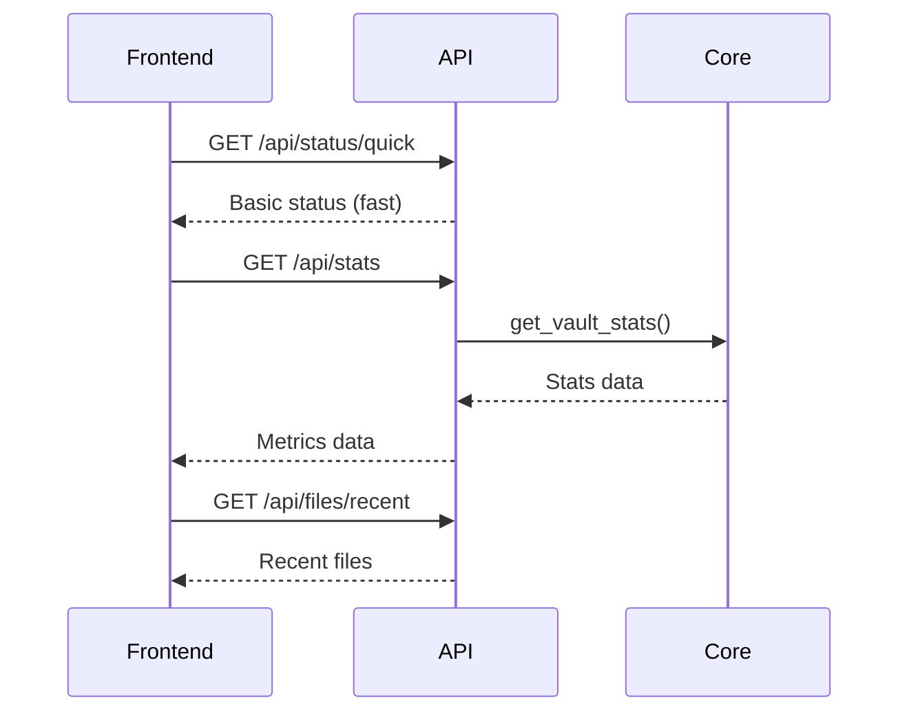
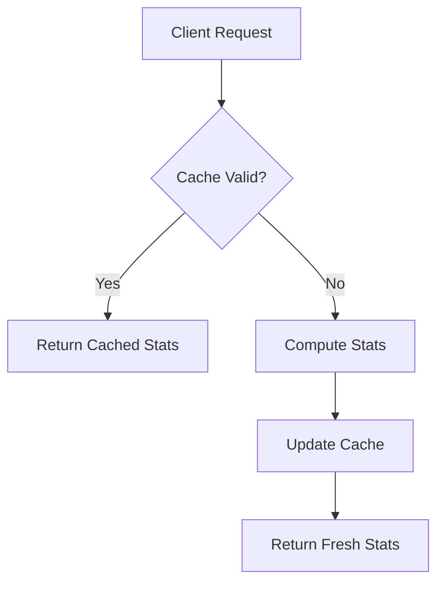

# Dashboard Metrics Display Fix

## Overview

The dashboard metrics (Total Files, Tagged Files, and Unique Tags) are currently not displaying values when they previously worked correctly. This appears to be a regression from recent performance optimizations where the `/api/status` endpoint was modified to exclude expensive stats by default.

## Problem Analysis

### Root Cause

The dashboard loading logic in `loadDashboard()` function calls `/api/status` without the `stats=true` parameter, which means the vault statistics are not being fetched. The recent performance optimization made stats optional to improve initial load time, but the frontend wasn't updated to explicitly request stats when needed.

### Current Behavior

1. Dashboard loads quickly with skeleton loaders
2. Quick status endpoint provides basic vault path and AI status  
3. Main status endpoint is called without `stats=true` parameter
4. `updateDashboardStats()` receives empty or undefined stats object
5. Dashboard metrics show "-" instead of actual values

### Expected Behavior

1. Dashboard should display actual values for:
   - Total Files (total markdown files in vault)
   - Tagged Files (files that have tags in frontmatter)
   - Unique Tags (total number of unique tags across all files)

## Technical Analysis

### API Endpoint Structure

The `/api/status` endpoint supports an optional `stats` query parameter:
- `/api/status` - Returns basic status without expensive stats (fast)
- `/api/status?stats=true` - Returns full status including vault statistics (slower)

### Frontend Loading Strategy

Current implementation uses progressive loading:
1. Quick status for immediate feedback
2. Detailed status without stats 
3. Recent files separately

### Missing Link

The frontend calls `this.apiGet('/status')` but needs `this.apiGet('/status?stats=true')` to get the metrics data.

## Solution Design

### Approach 1: Dedicated Stats Endpoint (Recommended)

Create a separate `/api/stats` endpoint specifically for dashboard metrics to enable independent loading and caching.



#### Benefits
- Dedicated endpoint for metrics
- Independent caching control
- Clear separation of concerns
- Maintains fast initial page load

#### Implementation
1. Add new `/api/stats` endpoint in web interface
2. Update frontend to call this endpoint separately
3. Implement proper error handling for stats failures

### Approach 2: Fix Current Implementation

Modify the existing frontend code to request stats when needed.

#### Implementation
1. Update `loadDashboard()` to call `/api/status?stats=true`
2. Add fallback for stats failures
3. Maintain current endpoint structure

## Detailed Implementation Plan

### Backend Changes

#### New API Endpoint: `/api/stats`

```python
@self.app.route('/api/stats')
def get_vault_stats():
    """Get vault statistics separately for dashboard metrics."""
    try:
        stats_result = self.automator.get_vault_stats()
        if stats_result['success']:
            return jsonify({
                'success': True,
                'stats': stats_result['stats'],
                'timestamp': datetime.now().isoformat()
            })
        else:
            return jsonify({
                'success': False,
                'error': stats_result.get('message', 'Failed to get stats'),
                'stats': {}
            })
    except Exception as e:
        return jsonify({
            'success': False,
            'error': str(e),
            'stats': {}
        }), 500
```

#### Enhanced Error Handling

Add proper error responses when stats computation fails due to:
- Vault path not found
- Permission issues
- Large vault timeout
- Malformed files

### Frontend Changes

#### Modified Dashboard Loading

```javascript
async loadDashboard() {
    try {
        // Show skeleton loaders immediately
        this.showSkeletonLoaders();
        
        // Step 1: Load quick status first
        const quickStatus = await this.apiGet('/status/quick');
        this.updateBasicStatus(quickStatus);
        
        // Step 2: Load data in parallel
        const [statusPromise, statsPromise, filesPromise] = [
            this.apiGet('/status'),
            this.apiGet('/stats'), // New dedicated stats endpoint
            this.apiGet('/files/recent?limit=20')
        ];
        
        const [status, stats, files] = await Promise.allSettled([
            statusPromise, statsPromise, filesPromise
        ]);
        
        // Handle results with proper error handling
        if (status.status === 'fulfilled' && status.value.success) {
            this.updateStatusPanel(status.value);
        }
        
        if (stats.status === 'fulfilled' && stats.value.success) {
            this.updateDashboardStats(stats.value.stats);
        } else {
            this.showStatsError(stats.reason || stats.value?.error);
        }
        
        if (files.status === 'fulfilled' && files.value.success) {
            this.updateRecentActivityProgressive(files.value);
        }
        
        this.hideSkeletonLoaders();
        
    } catch (error) {
        console.error('Failed to load dashboard:', error);
        this.showLoadingError('dashboard');
    }
}
```

#### Enhanced Error Display

```javascript
showStatsError(error) {
    // Show error state in stats cards instead of "-"
    const statsElements = [
        'dashboard-total-files',
        'dashboard-tagged-files', 
        'dashboard-unique-tags'
    ];
    
    statsElements.forEach(id => {
        const element = document.getElementById(id);
        if (element) {
            element.innerHTML = `
                <span class="text-red-400 text-sm">
                    <i class="fas fa-exclamation-triangle mr-1"></i>
                    Error
                </span>
            `;
        }
    });
    
    // Show error notification
    this.showNotification('error', 'Stats Error', 
        'Failed to load vault statistics: ' + error);
}
```

### Performance Optimizations

#### Caching Strategy



#### Progressive Loading

1. **Phase 1**: Quick status (< 100ms)
2. **Phase 2**: Stats computation (< 2s)  
3. **Phase 3**: Recent files (< 1s)

#### Error Resilience

- Graceful degradation when stats fail
- Retry mechanism for transient failures
- Clear error messages for user guidance

## Testing Strategy

### Unit Tests

1. Test `/api/stats` endpoint with various vault states
2. Test frontend stats loading with mock responses
3. Test error handling scenarios

### Integration Tests

1. Test complete dashboard loading flow
2. Test with different vault sizes
3. Test error recovery mechanisms

### Performance Tests

1. Measure stats computation time for large vaults
2. Test caching effectiveness
3. Verify progressive loading behavior

## Migration Plan

### Phase 1: Backend Implementation
1. Add new `/api/stats` endpoint
2. Implement enhanced error handling
3. Add endpoint tests

### Phase 2: Frontend Updates  
1. Update dashboard loading logic
2. Implement new error display states
3. Add client-side tests

### Phase 3: Monitoring & Optimization
1. Monitor stats endpoint performance
2. Optimize cache settings if needed
3. Gather user feedback

## Risk Assessment

### Low Risk
- New endpoint addition (no breaking changes)
- Backward compatibility maintained
- Progressive enhancement approach

### Mitigation Strategies
- Fallback to original endpoint if new one fails
- Comprehensive error handling
- Gradual rollout with monitoring

## Success Metrics

### Functional
- Dashboard metrics display correct values
- Error states properly handled
- Performance maintained or improved

### Performance
- Initial page load time < 2 seconds
- Stats loading time < 3 seconds for typical vaults
- Error recovery time < 1 second