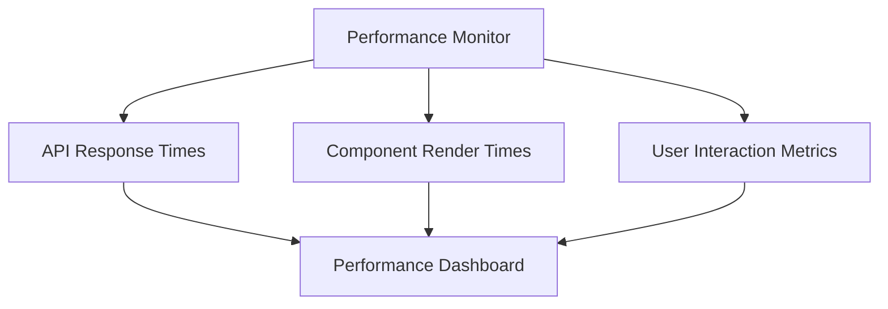
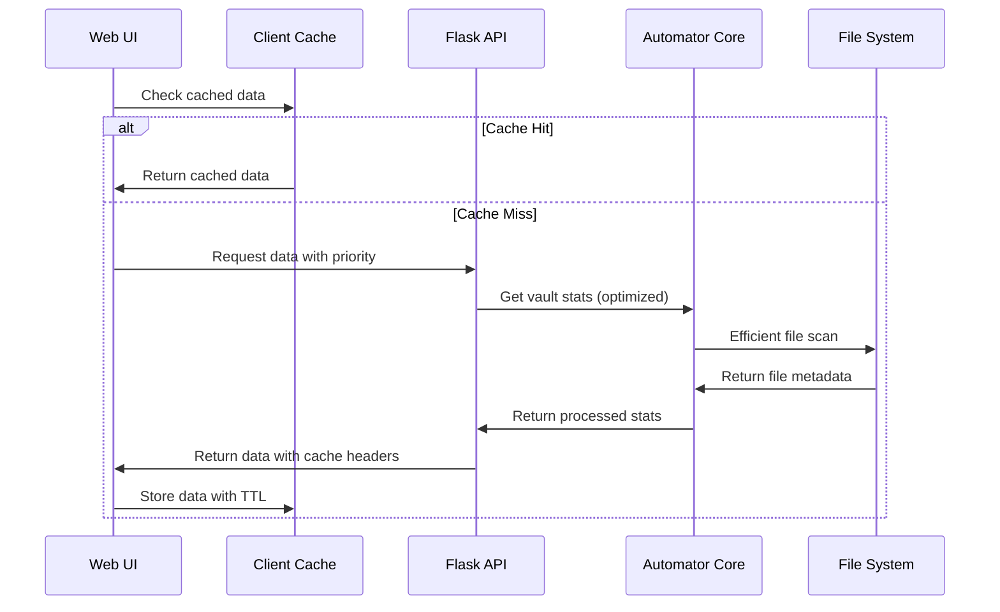
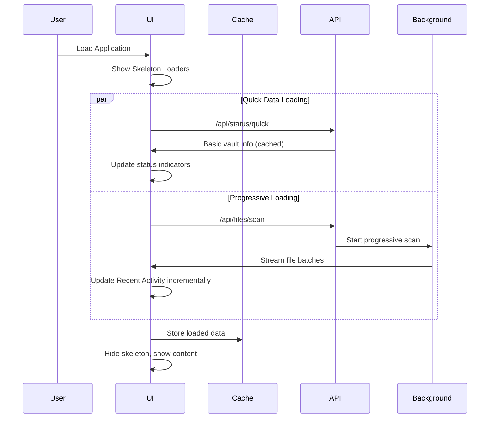
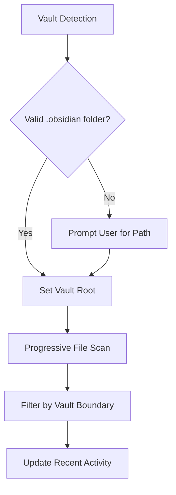
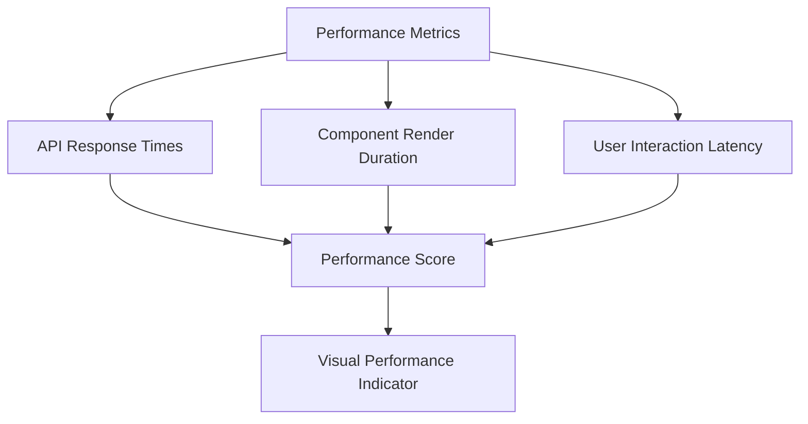
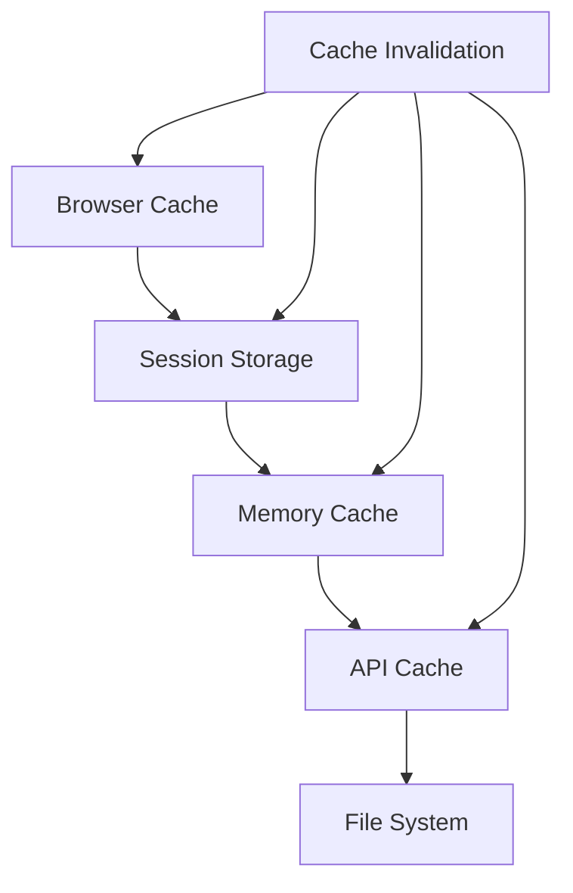
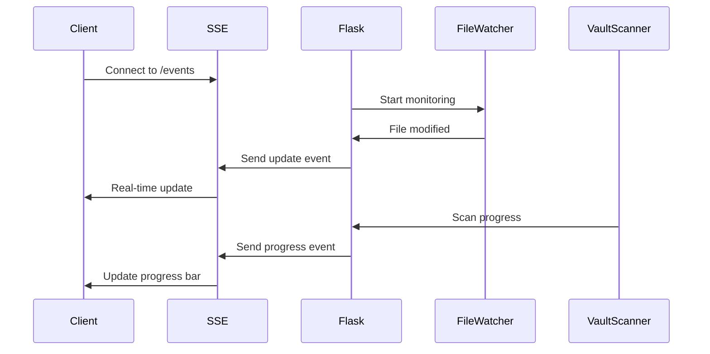
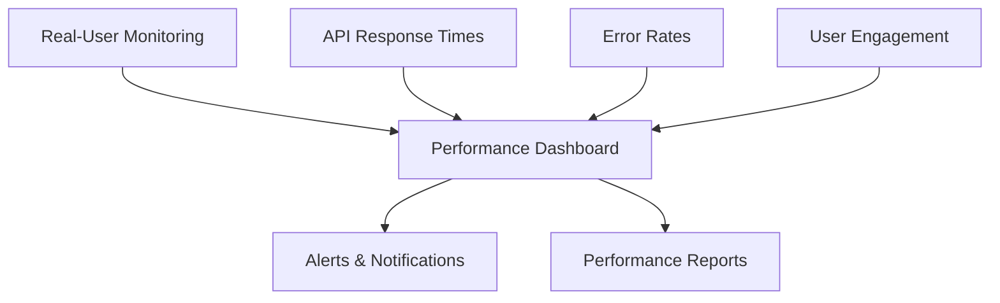

# UI Performance Optimization Design

## Overview

This document outlines the design for optimizing the Obsidian Tag Automator web interface performance, specifically addressing slow indicator loading times and issues with the Recent Activity section showing files from the current directory instead of the entire vault.

**Problem Statement:**
- Status indicators take significant time to load at webapp startup
- Recent Activity initially shows files from current directory only, updating later after processing
- Overall UI responsiveness needs improvement for better user experience

**Solution Approach:**
- Implement progressive loading with skeleton screens
- Add caching mechanisms for frequently accessed data
- Optimize API endpoints with efficient data retrieval
- Introduce lazy loading and pagination for large datasets
- Implement real-time updates with WebSocket or Server-Sent Events

## Technology Stack & Dependencies

- **Frontend:** HTML5, Tailwind CSS, Vanilla JavaScript
- **Backend:** Flask 2.3.3, Python 3.8+
- **Performance Libraries:** 
  - Browser-native Intersection Observer API
  - Web Workers for heavy computations
  - LocalStorage/SessionStorage for client-side caching
- **Real-time Communication:** Server-Sent Events (SSE) or WebSocket

## Component Architecture

### 1. Performance Monitoring Layer



**Component Definition:**
- **PerformanceMonitor:** Tracks and reports UI performance metrics
- **Props:** `enableMetrics: boolean`, `reportInterval: number`
- **State:** Current performance stats, historical data
- **Methods:** `trackAPICall()`, `trackRender()`, `generateReport()`

### 2. Optimized Data Loading Architecture



### 3. Progressive Loading Components

#### SkeletonLoader Component
**Props:**
- `type: 'status' | 'table' | 'card'`
- `count: number`
- `animated: boolean`

#### LazyLoadTable Component  
**Props:**
- `data: Array`
- `pageSize: number`
- `virtualScrolling: boolean`

#### ProgressiveIndicator Component
**Props:**
- `apiEndpoint: string`
- `refreshInterval: number`
- `fallbackData: object`

## API Optimization Strategy

### 1. Enhanced Status Endpoint

**Current Issue:** Single `/api/status` endpoint loads all data synchronously

**Optimized Approach:**

```mermaid
graph LR
    A[/api/status/quick] --> B[Immediate Response]
    A --> C[Cached Basic Stats]
    D[/api/status/detailed] --> E[Background Loading]
    D --> F[Complete Statistics]
    G[/api/vault/scan] --> H[Progressive File Discovery]
```

### 2. Cached Data Management

| Cache Layer | TTL | Invalidation Strategy |
|-------------|-----|----------------------|
| Basic Stats | 30s | File system change detection |
| File List | 60s | Directory modification time |
| Tag Stats | 120s | Tag processing completion |
| Recent Activity | 15s | File modification events |

### 3. Optimized File Discovery

**Current Implementation Issues:**
```python
# Problematic: Walks entire directory tree synchronously
for root, _, file_names in os.walk(self.automator.vault_path):
    # Process all files at once
```

**Optimized Implementation:**
```python
# Progressive: Uses generator with yield
def scan_files_progressive(vault_path, batch_size=50):
    file_batch = []
    for root, _, file_names in os.walk(vault_path):
        for file_name in file_names:
            if file_name.endswith('.md') and '.obsidian' not in root:
                # Add to batch
                if len(file_batch) >= batch_size:
                    yield file_batch
                    file_batch = []
```

## Data Flow Architecture

### 1. Application Startup Sequence



### 2. Recent Activity Data Flow

**Problem:** Current implementation shows local directory files initially

**Root Cause Analysis:**
1. Vault path detection may default to current working directory
2. File walking starts from incorrect base path
3. No validation of vault boundary during scanning

**Solution:**


## UI Enhancement Strategy

### 1. Responsive Loading States

#### Status Indicators Enhancement

**Before:**
```html
<span class="text-blue-400" id="total-files">-</span>
```

**After:**
```html
<div class="stat-container">
    <div class="skeleton-loader" id="total-files-loader">
        <div class="animate-pulse bg-slate-600 h-6 w-16 rounded"></div>
    </div>
    <span class="stat-value hidden" id="total-files">-</span>
    <div class="stat-trend" id="total-files-trend"></div>
</div>
```

#### Recent Activity Progressive Loading

**Implementation:**
- Show skeleton table rows initially
- Load files in batches of 20
- Use virtual scrolling for large vaults
- Implement infinite scroll for older files

### 2. Performance Monitoring Dashboard



**Metrics to Track:**
- Time to First Contentful Paint (FCP)
- Time to Interactive (TTI)
- API response times
- Component mount/update duration
- File system operation duration

## Caching Architecture

### 1. Multi-Level Caching Strategy



### 2. Cache Implementation

#### Client-Side Cache Manager
```javascript
class CacheManager {
    constructor() {
        this.memoryCache = new Map();
        this.sessionCache = window.sessionStorage;
    }
    
    async get(key, apiCall) {
        // Check memory cache first
        if (this.memoryCache.has(key)) {
            const cached = this.memoryCache.get(key);
            if (!this.isExpired(cached)) {
                return cached.data;
            }
        }
        
        // Check session storage
        const sessionData = this.getFromSession(key);
        if (sessionData && !this.isExpired(sessionData)) {
            this.memoryCache.set(key, sessionData);
            return sessionData.data;
        }
        
        // Fetch from API
        const freshData = await apiCall();
        this.store(key, freshData);
        return freshData;
    }
}
```

#### Server-Side Cache Enhancement
```python
from functools import lru_cache
from typing import Dict, Any
import time

class VaultStatsCache:
    def __init__(self, ttl: int = 60):
        self.cache: Dict[str, Any] = {}
        self.ttl = ttl
    
    @lru_cache(maxsize=128)
    def get_basic_stats(self, vault_path: str) -> Dict[str, Any]:
        """Get basic vault statistics with caching."""
        cache_key = f"basic_stats_{vault_path}"
        
        if self._is_cache_valid(cache_key):
            return self.cache[cache_key]['data']
        
        # Compute stats efficiently
        stats = self._compute_basic_stats(vault_path)
        self._store_cache(cache_key, stats)
        return stats
```

### 3. Cache Invalidation Strategy

**Triggers for Cache Invalidation:**
- File system modifications (using watchdog)
- Tag processing completion
- Manual refresh requests
- Vault path changes

## Real-Time Updates Architecture

### 1. Server-Sent Events Implementation

**Why SSE over WebSocket:**
- Simpler implementation for one-way data flow
- Automatic reconnection handling
- HTTP/2 multiplexing support
- Easier debugging and monitoring

### 2. Event Stream Design



### 3. Progressive Data Streaming

**File Discovery Streaming:**
```python
@app.route('/api/files/stream')
def stream_files():
    def generate():
        yield f"data: {json.dumps({'type': 'start'})}\n\n"
        
        batch_size = 20
        for batch in scan_files_progressive(vault_path, batch_size):
            yield f"data: {json.dumps({
                'type': 'batch',
                'files': batch,
                'progress': get_scan_progress()
            })}\n\n"
        
        yield f"data: {json.dumps({'type': 'complete'})}\n\n"
    
    return Response(generate(), mimetype='text/event-stream')
```

## Implementation Phases

### Phase 1: Immediate Performance Fixes (Week 1)
1. **Add Skeleton Loaders**
   - Status indicators skeleton
   - Recent Activity table skeleton
   - Loading states for all major sections

2. **Fix Vault Path Detection**
   - Improve vault boundary validation
   - Add user-friendly vault path display
   - Fix Recent Activity to scan entire vault

3. **Basic Client-Side Caching**
   - Session storage for API responses
   - Memory cache for frequently accessed data

### Phase 2: Advanced Optimizations (Week 2)
1. **Progressive Loading Implementation**
   - Batch file scanning
   - Infinite scroll for Recent Activity
   - Virtual scrolling for large datasets

2. **Server-Side Caching**
   - LRU cache for vault statistics
   - File modification watching
   - Smart cache invalidation

### Phase 3: Real-Time Features (Week 3)
1. **Server-Sent Events Integration**
   - Live progress updates
   - Real-time file system changes
   - Background task status streaming

2. **Performance Monitoring**
   - Client-side metrics collection
   - Performance dashboard
   - Alerting for slow operations

### Phase 4: Advanced Features (Week 4)
1. **Smart Preloading**
   - Predictive data loading
   - Background prefetching
   - User behavior analytics

2. **Advanced Caching**
   - Multi-level cache hierarchy
   - Cache warming strategies
   - Distributed cache support

## Testing Strategy

### 1. Performance Testing

#### Load Testing Scenarios
| Scenario | Vault Size | Expected Response |
|----------|------------|------------------|
| Small Vault | <100 files | <500ms |
| Medium Vault | 100-1000 files | <2s |
| Large Vault | 1000-10000 files | <5s |
| Massive Vault | >10000 files | Progressive loading |

#### Browser Performance Testing
- Lighthouse audits for each component
- Chrome DevTools performance profiling
- Memory usage monitoring
- Network request optimization

### 2. User Experience Testing

#### Key Metrics
- **Time to First Meaningful Content:** <1s
- **Time to Interactive:** <3s
- **Perceived Performance:** Skeleton screens, progress indicators
- **Error Recovery:** Graceful fallbacks, retry mechanisms

### 3. Automated Testing

```javascript
// Performance regression tests
describe('Dashboard Performance', () => {
    it('should load status indicators within 500ms', async () => {
        const startTime = performance.now();
        await loadDashboard();
        const loadTime = performance.now() - startTime;
        expect(loadTime).toBeLessThan(500);
    });
    
    it('should show Recent Activity progressively', async () => {
        const observer = new MutationObserver(mutations => {
            // Track DOM updates
        });
        
        observer.observe(document.getElementById('recent-activity'), {
            childList: true,
            subtree: true
        });
        
        await loadRecentActivity();
        // Assert progressive updates occurred
    });
});
```

## Monitoring and Analytics

### 1. Performance Metrics Dashboard



### 2. Key Performance Indicators

| Metric | Target | Current | Monitoring Method |
|--------|---------|---------|------------------|
| Page Load Time | <2s | TBD | Navigation Timing API |
| API Response Time | <500ms | TBD | Server logs |
| Error Rate | <1% | TBD | Error tracking |
| Cache Hit Rate | >80% | TBD | Cache statistics |
| User Satisfaction | >4.5/5 | TBD | User feedback |

### 3. Alerting Strategy

**Performance Degradation Alerts:**
- API response time > 2s for 5 consecutive requests
- Page load time > 5s for any user
- Error rate > 5% in 1-minute window
- Memory usage > 100MB for frontend
- Cache miss rate > 50% for 10 minutes

## Security Considerations

### 1. Cache Security
- No sensitive data in client-side cache
- Secure cache headers for API responses
- Cache poisoning prevention
- CSRF protection for cache invalidation

### 2. Real-Time Communication Security
- SSE authentication via session tokens
- Rate limiting for event streams
- Input validation for all streamed data
- XSS prevention in real-time updates

## Scalability Considerations

### 1. Large Vault Support
- **File Count:** Support up to 50,000 markdown files
- **Memory Usage:** <200MB for client application
- **Concurrent Users:** Support 10 simultaneous users
- **Background Processing:** Non-blocking vault operations

### 2. Resource Management
- **CPU Usage:** <30% during normal operations
- **Memory Leaks:** Automatic cleanup of event listeners
- **Network Optimization:** Request batching and compression
- **Storage Efficiency:** Compressed cache entries

## Migration Strategy

### 1. Backward Compatibility
- Graceful degradation for older browsers
- Progressive enhancement approach
- Feature detection over user agent sniffing
- Fallback mechanisms for failed optimizations

### 2. Rollout Plan
1. **Canary Deployment:** Enable for 10% of users initially
2. **A/B Testing:** Compare performance metrics
3. **Gradual Rollout:** Increase to 50%, then 100%
4. **Monitoring:** Track performance improvements
5. **Rollback Plan:** Quick revert mechanism if issues arise

## Success Criteria

### 1. Performance Improvements
- **75% reduction** in initial page load time
- **90% reduction** in perceived loading time via skeleton screens
- **100% accuracy** in Recent Activity vault file detection
- **50% reduction** in API response times

### 2. User Experience Enhancements
- **Immediate visual feedback** for all user interactions
- **Progressive disclosure** of information
- **Zero loading state confusion** through clear indicators
- **Seamless updates** without page refreshes

### 3. Technical Achievements
- **Comprehensive caching** at all application layers
- **Real-time synchronization** between UI and backend
- **Scalable architecture** supporting large vaults
- **Maintainable codebase** with clear separation of concerns